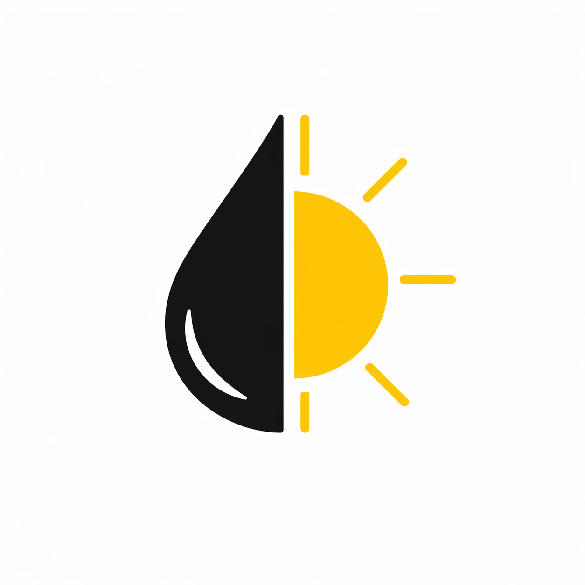
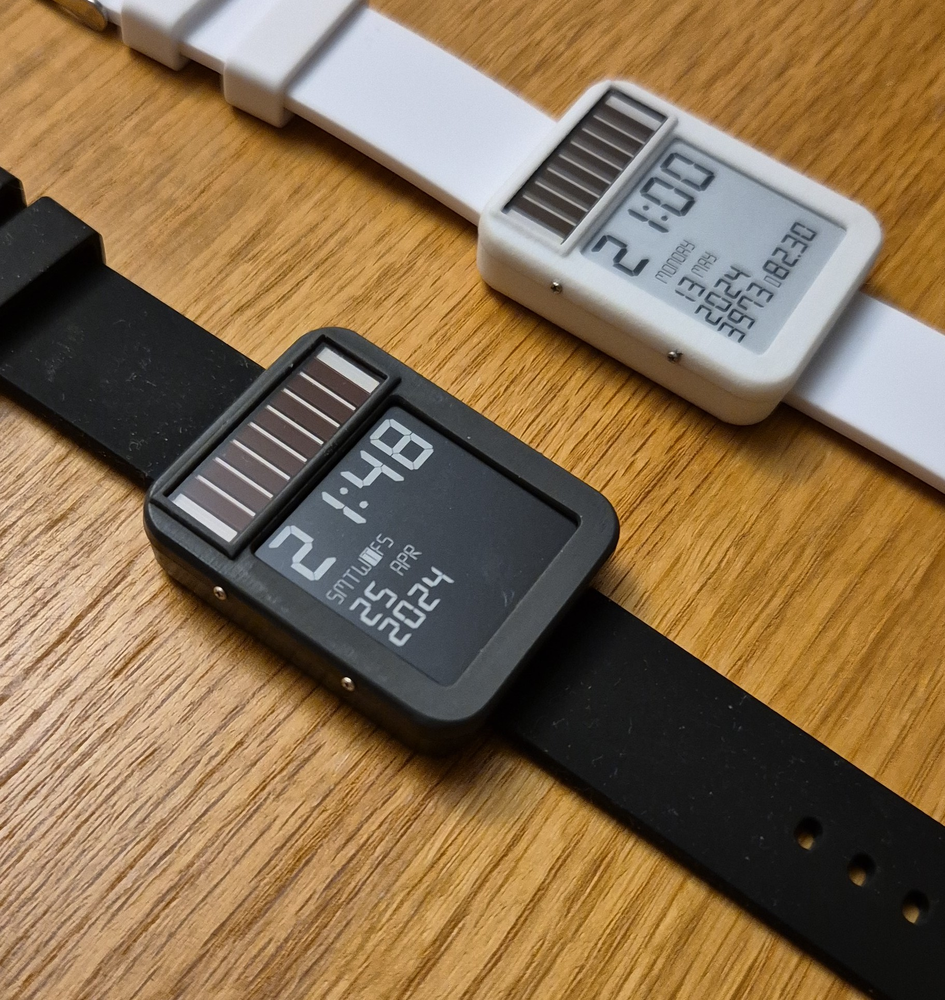

#  LightInk project

E-Ink ESP32 powered Watch that can run solely on solar power!

<p align="center"></p>

## What is it?

The main porpose of LightInk project is to have a functional and basic E-Ink watch that can be powered via Solar cell entirely. The power consumption is around 2uA just updating time, therefore a 200mAh battery like "Watchy" has can last around 400 days! (or powered by a small solar cell)

The project is based around the "Watchy" idea, but requires specific HW to reach these low power levels. Basically differs in:
* Has a better TPS63900 power source of 2.6/2.9V
  * More efficient (DC-DC 75nA quiscent, 1A, 1.8-5V regulation, which 2 configurable voltages)
  * This is enough to power ESP32/RTC/Eink and WiFi under all conditions
* Does not have accelerometer (too much power!, even disabled, uses 1uA)
* Does not have solar cell regulation, is connected directly to batery
* Piezo speaker support
* LED light to see display in dark
* Capacitive touch instead of buttons
* Support for LORA/GPS, but yes, they use too much power! (only turn on to send a signal)

## More info

Hackaday.io project page: https://hackaday.io/project/205564-lightink

Youtube channel: https://www.youtube.com/channel/UC85IYb1iQYl5axvtkAJRysg

Videos: 
[![Demo solar video]](https://youtu.be/erjeWSajqhQ?si=WS1v5kafEWmZIDvW)
[![Demo features video]](https://youtu.be/qBj7sOVVzNI?si=8qa2g7JaOwrqm9AO)

Other links: https://www.hackster.io/news/the-lightink-watch-pairs-a-solar-panel-with-epaper-to-deliver-theoretically-infinite-battery-life-ac8c0fdec287


## What is done already ?

The project goals are:
- [X] Ultra low consumption <0.5 mAh/day!
  - [X] Custom Display Driver, reduce booster times/ LUT, etc..
  - [X] Implement a uSPI and display update from wake sleep stub (<1ms! ESP32 on time)
- [X] Basic UI functionality and Widgets
- [X] Features
  - [X] LED light
  - [X] Vibration
  - [X] Speaker
  - [X] GPS
  - [X] Lora receive, BPSK send signals
- [X] Time accurate
  - [X] Manual calibrate drift and adjust it
  - [X] 1ppm Target (now 10ppm)
  - [X] NTP sync - Wifi - AutoZone
- [X] Battery Power support
  - [ ] Track battery & estimate in ULP
  - [X] Auto power save
  - [X] Night time, saving ours
- [X] Touch Settings
  - [X] Capacitive Touch functionality
  - [X] Touch configuration - Sensitivity
- [ ] Watchface configuration
  - [ ] Refactor watchface to be modular with uSPI update
  - [X] Moon Indicator
  - [X] SunSet Sunrise
  - [ ] Tides
  - [ ] Pictures, etc
- [ ] Configurable Alarms
- [ ] BT - Companion App
- [ ] Support other boards
  - [ ] Watchy v1.0 -> [Watchy 1.0 Branch](https://github.com/DarkZeros/LightInk/tree/watchy_1.0)

## The purpose of this project

Have fun optimizing the hell out of this ESP32 to make it low power enough for a solar cell.
This all started as a challenge, that luckily it is starting to look like a real thing after many years.

My plan is to continue developing and adding features/fixes for my personal unit use.
I doubt it will become a comercial product since building a unit requires a lot of soldering.
However I am happy if someone can change my mind on how to mass produce it easily. :)

## Repo structure

```
lightink/
├── firmware/
│   ├── main/         # The LightInk firmware code
│   ├── components/   # Other components & subprojects used in the builds
│   └── esp-idf/      # The ESP-IDF version used to build (it has changes compared to upstream)
│   ...               # Other misc files like partitions / sdkconfig / ...
│
├── hardware/
│   ├── pcb/          # Schematics, BOM and diagrams
│   └── case/         # STL files for from and back
│
├── docs/
│   ├── images/       # images of the project
│   ...               # Hisotory and important docs
│
├── README.md
└── LICENSE
```
## More info

- 📖 [History](docs/HISTORY.md)
- 🛠️ [Hardware](hardware/HARDWARE.md)
- ✨ [Hardware - Case](hardware/case/CASE.md)
- ⚡ [Hardware - PCB](hardware/pcb/PCB.md)

## How to build the firmware?

It should be quite straightforward:
Just clone every submodule, use `setup.sh` and then `idf.py` to build:
```
git submodule update --init --recursive
cd firmware && ./setup.sh && idf.py build flash monitor
```

## Helping the project

Just push to a non protected branch and ask for PR.
Any contribution is welcomed.

If you want to build a unit for yourself, or support existing ESP32 HW (like watchy), please feel free to add support.
